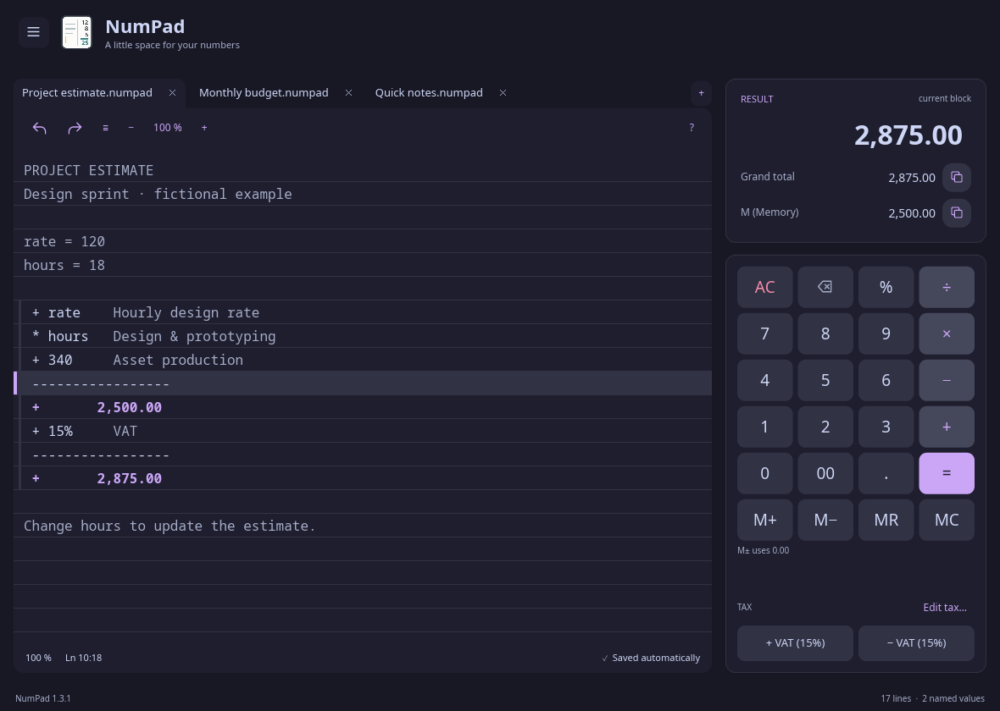
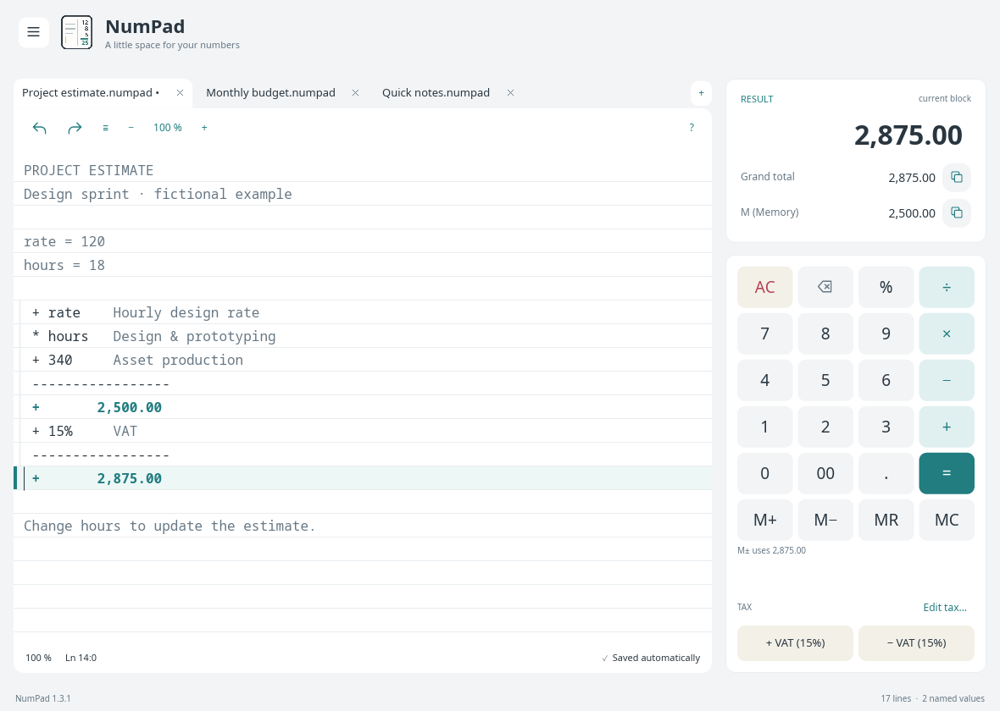
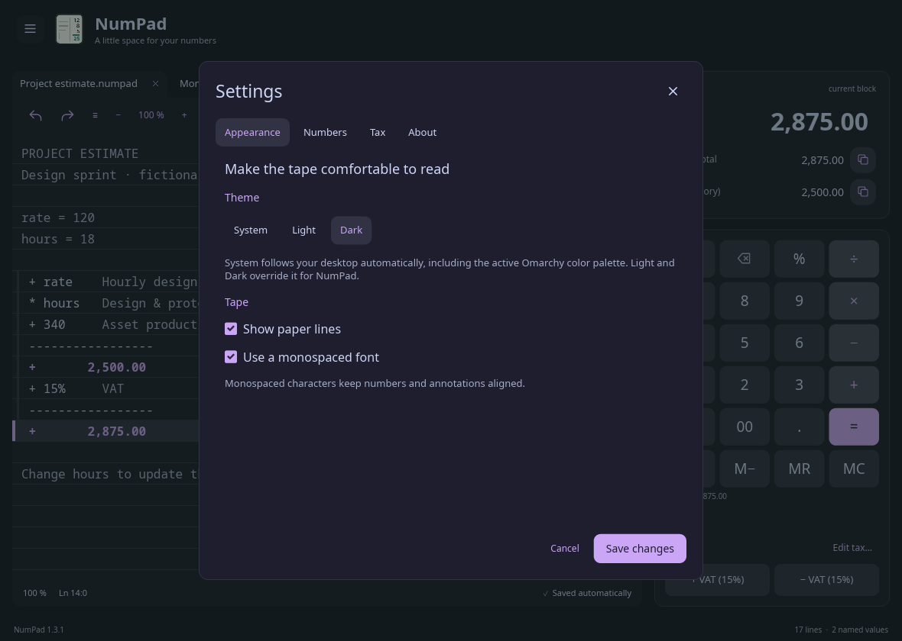
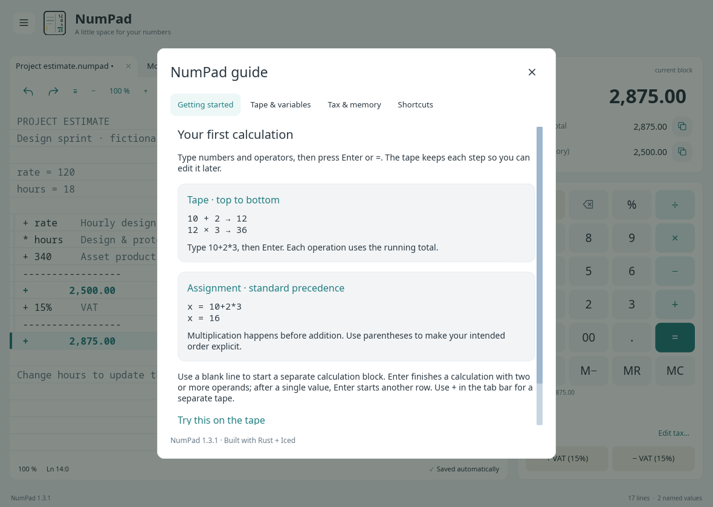
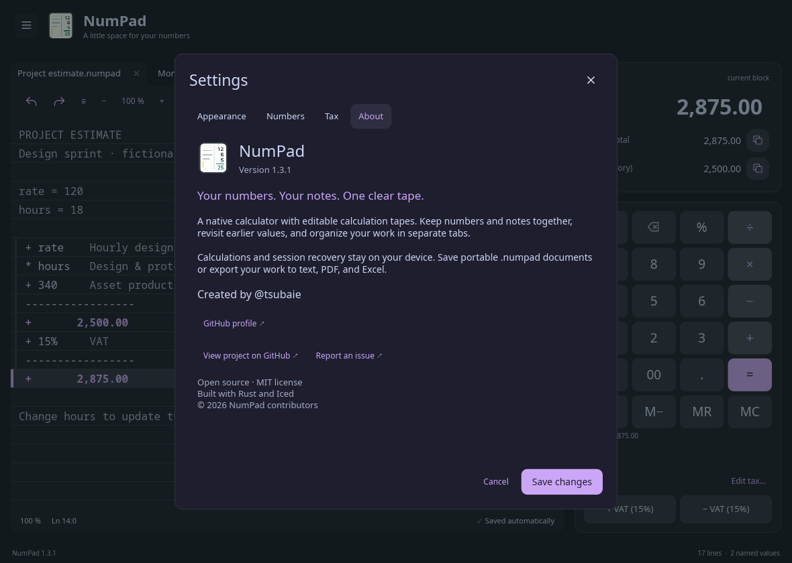

<div align="center">
  
  <h1>NumPad</h1>
  <p><strong>Your numbers. Your notes. One clear tape.</strong></p>
  <p>A native calculator that keeps the working, not just the answer.<br>Write numbers and notes, reuse named values, and organize your work in tabs.</p>
  <p>
    <a href="https://github.com/tsubaie/numpad/actions/workflows/build.yml"></a>
    <a href="LICENSE"></a>
    
  </p>
  <p><a href="#install">Install</a> · <a href="#how-the-tape-works">Quick start</a> · <a href="#screenshots">Screenshots</a> · <a href="#development-and-testing">Development</a></p>
  <p><sub>Linux, macOS & Windows · Rust + Iced · MIT licensed</sub></p>
</div>



## Why NumPad

NumPad is for the working behind a number: a project estimate, a shopping list, a quick budget, or a calculation you want to revisit. Write numbers and notes on the same tape, then change any earlier value to update the totals below it.

- **A tape you can edit.** Annotate amounts, correct earlier inputs, and watch dependent subtotals update.
- **Room for more than one task.** Connected document tabs keep separate tapes, memory, undo history, and files. Restore your open work after restarting.
- **Named values that stay connected.** Define a rate or quantity once and reuse it throughout the tape.
- **Everyday calculation tools.** Percentages, memory, scientific functions, and shared add/remove tax controls. VAT starts at 15% and is configurable.
- **At home on your desktop.** Follow the system theme—including Omarchy's current palette—or choose Light or Dark. Adjust zoom, ruled paper, and the tape font in one tabbed Settings window.
- **Your work stays local.** Automatic session recovery, portable `.numpad` documents, and exports to text, PDF, and Excel.
- **A native desktop app.** Written in Rust with Iced. No browser runtime, account, or server required.

## Screenshots

Closing the last tab exits NumPad. Unsaved changes offer **Save & close**, **Discard**, or **Cancel**.

The same fictional estimate in Light. Each active tab joins the tape below it; the calculator and totals stay alongside your work.




<details>
<summary><strong>Settings, the built-in guide, and About</strong></summary>

Appearance, Numbers, Tax, and About live in one window. Save changes together, or cancel without changing your preferences.



The guide explains how sequential tape calculations differ from assignment expressions, with examples you can try.



Project information, credits, and GitHub links are available inside the app.



</details>

<sub>Real Linux/X11 captures from the current source, using only fictional demo data. Screenshots may include improvements not yet in the latest packaged release. [Reproduce the screenshots](docs/SCREENSHOTS.md).</sub>

## How the tape works

### One operation per line

Typing an operator starts a new tape line. Operations run **top to bottom**, like a running calculator:

```text
  10
+  2
×  3
────
  36
```

Type `10+2*3`, then press **Enter** to produce this result. Enter closes a multi-operand calculation and inserts its subtotal.

Use a blank line for an independent calculation block and **Enter** or **=** for a subtotal. Open **?** for the tabbed guide and worked examples.

Use **+** in the tab bar or **Ctrl/Cmd+T** to create a separate tape. Each tab keeps its own calculation, memory, undo history, and file path while open. Open tabs and their contents recover after restarting; unsaved tabs ask before closing. **Ctrl/Cmd+Tab** switches tabs and **Ctrl/Cmd+W** closes the current tab.

This is intentionally different from an assignment expression. In `answer = 10+2*3`, standard mathematical precedence applies, so `answer` is **16**.

### Give numbers a purpose

```text
rate = 120
hours = 18

+ rate     Hourly design rate
* hours    Design & prototyping
+ 340      Asset production
```

Press **Enter** after the last amount for a subtotal of **2,500.00**. Add `+15%` and press Enter again for **2,875.00**. Edit `hours` and the dependent totals recalculate.

A blank line or a standalone note starts an independent calculation. An inline comment stays attached to its amount. Completed totals can be named and reused.

### Predictable percentages and tax

Adding or subtracting a percentage applies it to the running amount. The two tax buttons share one name and rate in **Tax settings**:

- **+ VAT (15%)** adds tax: `100 → 115`.
- **− VAT (15%)** removes included tax: `115 → 100`.

Removing included tax divides by `1.15`; it does not subtract 15% from the tax-inclusive amount. Button labels always reflect the saved rate. Number grouping uses three-digit groups, such as `1,000,000`.

**Menu → Settings** groups Appearance, Numbers, Tax, and About into tabs. Appearance includes the tape font choice; About includes project and author links. Changes apply together with **Save changes**; Cancel or Escape discards them. **Edit tax…** above the tax buttons opens the Tax tab directly.

Theme defaults to **System**. On Omarchy, NumPad reads the current desktop palette and follows theme changes automatically without changing desktop configuration. On other desktops, it follows the system light/dark preference. Choose **Light** or **Dark** in Appearance to override this for NumPad.

## Install

### Quick install — Linux and macOS

~~~sh
curl -fsSL https://raw.githubusercontent.com/tsubaie/numpad/main/install.sh | sh
~~~

[Read the installer](install.sh) first. It downloads the latest release, verifies the selected file against **SHA256SUMS**, and installs without compiling anything.

- **Linux x86_64:** uses apt, dnf, or pacman when available. Other distributions get a per-user installation in **~/.local**.
- **macOS Intel and Apple Silicon:** chooses the matching app and installs it in **~/Applications/NumPad.app**. Run it as your normal user, without sudo.
- Re-run the command to update. Your saved calculations and session data are not modified.

Prefer a per-user Linux install or a specific version?

~~~sh
curl -fsSL https://raw.githubusercontent.com/tsubaie/numpad/main/install.sh | NUMPAD_INSTALL=tarball sh
curl -fsSL https://raw.githubusercontent.com/tsubaie/numpad/main/install.sh | NUMPAD_VERSION=1.3.1 sh
~~~

### Download a package

Get the files from [Releases](https://github.com/tsubaie/numpad/releases/latest):

| Platform | Download | Install |
| :--- | :--- | :--- |
| Debian / Ubuntu, x86_64 | `numpad_*_amd64.deb` | `sudo apt install ./numpad_*_amd64.deb` |
| Fedora, x86_64 | `numpad-*.x86_64.rpm` | `sudo dnf install ./numpad-*.x86_64.rpm` |
| Arch / Omarchy, x86_64 | `numpad-*.pkg.tar.zst` | `sudo pacman -U ./numpad-*.pkg.tar.zst` |
| Other glibc Linux, x86_64 | `numpad-*-linux-x86_64.tar.gz` | Use the per-user quick installer above |
| macOS, Apple Silicon | `numpad-*-macos-arm64.dmg` | Open the DMG; drag NumPad to Applications |
| macOS, Intel | `numpad-*-macos-x86_64.dmg` | Open the DMG; drag NumPad to Applications |
| Windows, x86_64 | `NumPad-*-windows-x64.zip` | Extract the ZIP; run `NumPad.exe` |

**Requirements:** Linux downloads require glibc 2.35+ (Ubuntu 22.04 / Debian 12 or newer) and the desktop libraries declared by the packages. Wayland file dialogs need a desktop portal and the appropriate backend. Alpine/musl and Linux ARM are not included. macOS builds target 11.0+.

**Signing:** macOS apps are ad-hoc signed, not Apple-notarized. Windows binaries and Linux packages are not publisher-signed. Your OS may ask you to approve opening the app. The installer does not disable security checks. Release checksums detect corrupted downloads; they are not independent proof of publisher identity.

### Build from source

Install stable Rust with edition 2024 support. Windows needs the Visual Studio C++ Build Tools and Windows SDK (MSVC toolchain); macOS needs Xcode Command Line Tools.

On Debian or Ubuntu, install the build dependencies:

~~~sh
sudo apt-get install build-essential pkg-config \
  libxkbcommon-dev libxkbcommon-x11-dev libwayland-dev \
  libx11-dev libxi-dev libxcursor-dev libxrandr-dev libgl1-mesa-dev
~~~

Then clone and run:

~~~sh
git clone https://github.com/tsubaie/numpad.git
cd numpad
cargo run --release --locked
~~~

The executable is **target/release/numpad.exe** on Windows, or **target/release/numpad** on Linux/macOS. See [builds and releases](docs/RELEASING.md) for local packaging, cache behavior, and publishing a version.

## Builds and releases

[GitHub Actions](https://github.com/tsubaie/numpad/actions/workflows/build.yml) runs formatting, Clippy, unit tests, real Linux UI tests, native builds, and packaging. Linux packages are installed in Debian, Fedora, and Arch containers for headless export checks. Releases require both native builds and the UI job to pass; other desktops still need manual interaction testing.

- Rust dependencies and build outputs are cached per platform/toolchain; the packaging tool has its own cache.
- Documentation-only changes skip native builds, and newer branch commits cancel superseded runs.
- Normal code builds produce Actions artifacts. Pushing a matching **vX.Y.Z** tag publishes a release after all jobs pass.
- Every release includes native packages and **SHA256SUMS**.

## Files, exports, and privacy

Use **Menu → Open / Save** for `.numpad` documents, and **Menu → Export** for text, PDF, or Excel. Native documents preserve the tape, number formatting, appearance, tax settings, and memory. Plain-text tapes can also be opened.

Your session is automatically saved in the operating system's local application-data directory. NumPad does not send calculations over the network. Set `NUMPAD_DATA_DIR` to a chosen directory to use an isolated or portable session.

A few details worth knowing:

- Display rounding is separate from internal decimal arithmetic.
- Excel exports contain values, not executable formulas. Numbers exceeding Excel's 15-digit precision are preserved as text.
- Unicode PDF export requires an available supported font, such as Consolas, DejaVu Sans Mono, or Courier New. Complex-script shaping is not certified.
- Current saves use document format version 2. Version 1 documents still open, but recalculate using the current top-to-bottom tape rules.
- Autosave helps recover a session; explicitly saved documents are still the best way to keep separate projects.

## Keyboard shortcuts

Use **Ctrl** on Windows/Linux and **Cmd** on macOS.

| Shortcut | Action |
| :--- | :--- |
| Enter or `=` | Complete a multi-operand calculation |
| Ctrl/Cmd + Z / Y | Undo / redo |
| Ctrl/Cmd + N / T | Open a new tape tab |
| Ctrl/Cmd + W | Close the current tab |
| Ctrl/Cmd + Tab / Shift + Tab | Next / previous tab |
| Ctrl/Cmd + O | Open a document |
| Ctrl/Cmd + S | Save |
| Ctrl/Cmd + Shift + S | Save as |
| Ctrl/Cmd + Shift + L | Toggle ruled paper |
| Ctrl/Cmd + plus / minus / 0 | Zoom in / out / reset |
| Ctrl + mouse wheel over the tape | Zoom in / out |
| F1 | Open the guide and examples |

## Development and testing

Start with the [source-build instructions](#build-from-source), [contribution guide](CONTRIBUTING.md), and [architecture overview](docs/ARCHITECTURE.md).

```sh
cargo fmt --check
cargo test --locked --bin numpad
cargo clippy --all-targets --locked -- -D warnings
```

### Real UI regression tests (Linux)

The UI suite launches NumPad in isolated processes and drives the actual application
with X11 mouse and keyboard events, including forced-restart recovery checks.

Install `Xvfb`, `xvfb-run`, `xdotool`, and system fonts (Ubuntu packages:
`xvfb xdotool fonts-dejavu-core`), then run:

```sh
cargo test --locked --bin numpad
xvfb-run -a -s '-screen 0 1280x1024x24' cargo test --locked --features e2e --test e2e
```

Coverage includes connected-tab geometry and seam colors, editing, undo/redo,
clipboard round-trips, menu click-away, Settings/About, theme Save/Cancel,
compact layout, keyboard/wheel zoom, long-tape scrolling, independent tabs,
and recovery after forced termination. Each run has isolated app/XDG data;
logs, state, and screenshots remain in `test-results/e2e/`.

The `e2e` feature enables read-only state/layout/screenshot probes only when
`NUMPAD_E2E_DIR` is set. Distribution builds must not enable it. CI runs the
suite separately from packaging and gates releases on it. These checks
complement unit tests and visual review; native file dialogs, Wayland,
Windows/macOS interactions, and exhaustive visual comparisons are not covered.

## Contributing

Bug reports, focused improvements, and platform testing are welcome. See [CONTRIBUTING.md](CONTRIBUTING.md) for setup, checks, and what to include in an issue. AI-assisted contributions are welcome: read the [AI contribution guidelines](CONTRIBUTING.md#ai-assisted-contributions) and [coding conventions](CONTRIBUTING.md#coding-conventions) before submitting a change.

The code separates arithmetic, tape evaluation, editing, persistence, and the native interface. Read the [architecture overview](docs/ARCHITECTURE.md) before making larger changes.

```sh
cargo fmt --check
cargo test --release --locked
cargo clippy --all-targets --locked -- -D warnings
```

## Author and license

Created by [@tsubaie](https://github.com/tsubaie). Have a bug or an idea? [Open an issue](https://github.com/tsubaie/numpad/issues).

NumPad is available under the [MIT License](LICENSE). Third-party dependencies retain their respective licenses.
