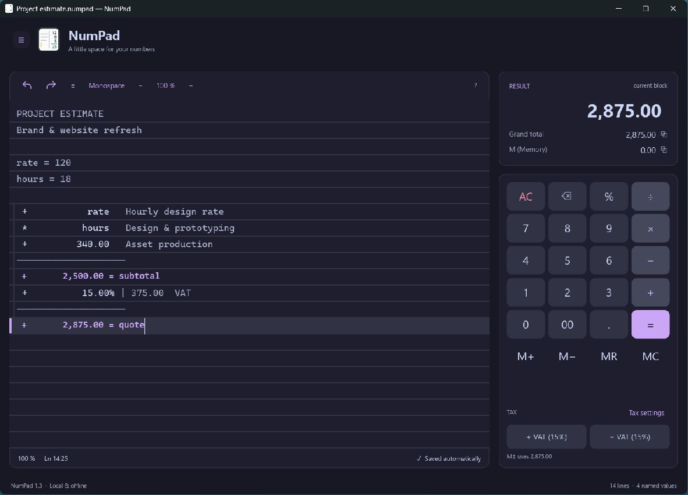
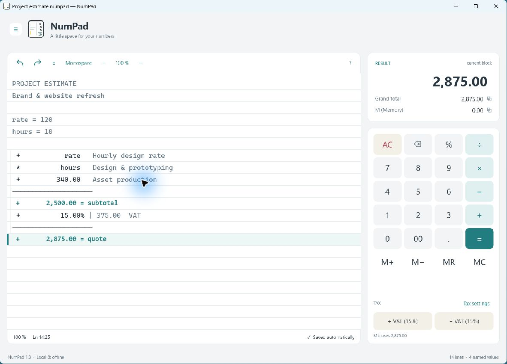

<div align="center">
  
  <h1>NumPad</h1>
  <p><strong>A little space for your numbers.</strong></p>
  <p>A native, offline calculator with an editable tape.<br>Keep the calculation, the context, and the answer together.</p>
  <p>
    <a href="https://github.com/tsubaie/numpad/actions/workflows/build.yml"></a>
    <a href="LICENSE"></a>
    
  </p>
  <p><a href="#get-started">Get started</a> · <a href="#how-the-tape-works">How it works</a> · <a href="CONTRIBUTING.md">Contribute</a></p>
</div>



## More than a final answer

NumPad is for the working behind a number: a project estimate, a shopping list, a quick budget, or a calculation you want to revisit. Write numbers and notes on the same tape, then change any earlier value to update the totals below it.

- **An editable calculation history.** Annotate individual amounts, separate calculations with notes, and keep subtotals alongside your work.
- **Named values that stay connected.** Define a rate or quantity once and reuse it throughout the tape.
- **Everyday calculation tools.** Percentages, memory, scientific functions, and shared add/remove tax controls. VAT starts at 15% and is configurable.
- **Two focused themes.** Catppuccin Mocha dark and a clean light theme, with optional ruled paper, a monospaced tape, and zoom.
- **Your work stays local.** Automatic session recovery, portable `.numpad` documents, and exports to text, PDF, and Excel.
- **A native desktop app.** Written in Rust with Iced. No browser runtime, account, or server required.

<details>
<summary><strong>See the light theme</strong></summary>



</details>

<sub>Actual NumPad 1.3 screenshots captured on Windows with a fictional demo document. Both themes are available in Menu → Settings.</sub>

## How the tape works

### One operation per line

Typing an operator starts a new tape line. Operations run **top to bottom**, like a running calculator:

```text
  10
+  2
×  3
────
  36
```

Type `10+2*3`, then press **Enter** to produce this result. Enter closes a multi-operand calculation and inserts its subtotal.

This is intentionally different from an assignment expression. In `answer = 10+2*3`, standard mathematical precedence applies, so `answer` is **16**.

### Give numbers a purpose

```text
rate = 120
hours = 18

+ rate     Hourly design rate
* hours    Design & prototyping
+ 340      Asset production
```

Press **Enter** after the last amount for a subtotal of **2,500.00**. Add `+15%` and press Enter again for **2,875.00**. Edit `hours` and the dependent totals recalculate.

A blank line or a standalone note starts an independent calculation. An inline comment stays attached to its amount. Completed totals can be named and reused.

### Predictable percentages and tax

Adding or subtracting a percentage applies it to the running amount. The two tax buttons share one name and rate in **Tax settings**:

- **+ VAT (15%)** adds tax: `100 → 115`.
- **− VAT (15%)** removes included tax: `115 → 100`.

Removing included tax divides by `1.15`; it does not subtract 15% from the tax-inclusive amount. Button labels always reflect the saved rate. Number grouping uses three-digit groups, such as `1,000,000`.

## Get started

### Build from source

Install a stable Rust toolchain with support for edition 2024, plus the native prerequisites below.

| Platform | Prerequisites |
| :--- | :--- |
| Windows | Visual Studio C++ Build Tools and the Windows SDK; use the Rust MSVC toolchain |
| Linux | A C/C++ toolchain, `pkg-config`, and the desktop libraries below |
| macOS | Xcode Command Line Tools |

On Debian or Ubuntu:

```sh
sudo apt-get install build-essential pkg-config \
  libxkbcommon-dev libxkbcommon-x11-dev libwayland-dev \
  libx11-dev libxi-dev libxcursor-dev libxrandr-dev libgl1-mesa-dev
```

Then clone and run:

```sh
git clone https://github.com/tsubaie/numpad.git
cd numpad
cargo run --release --locked
```

The compiled executable is `target/release/numpad.exe` on Windows and `target/release/numpad` on Linux or macOS.

Native test/build jobs run for all three platforms in [GitHub Actions](https://github.com/tsubaie/numpad/actions/workflows/build.yml). Successful runs provide downloadable build artifacts; these are development builds, not signed installers. Windows has been exercised interactively. Build checks alone do not certify the Linux or macOS desktop experience.

### Package a build

On Windows, create a portable ZIP:

```powershell
.\scripts\package.ps1
```

On macOS, create an unsigned app bundle:

```sh
./scripts/package-macos.sh
```

Packages are written to `release/`. macOS signing and notarization are not configured.

## Files, exports, and privacy

Use **Menu → Open / Save** for `.numpad` documents, and **Menu → Export** for text, PDF, or Excel. Native documents preserve the tape, number formatting, appearance, tax settings, and memory. Plain-text tapes can also be opened.

Your session is automatically saved in the operating system's local application-data directory. NumPad does not send calculations over the network. Set `NUMPAD_DATA_DIR` to a chosen directory to use an isolated or portable session.

A few details worth knowing:

- Display rounding is separate from internal decimal arithmetic.
- Excel exports contain values, not executable formulas. Numbers exceeding Excel's 15-digit precision are preserved as text.
- Unicode PDF export requires an available supported font, such as Consolas, DejaVu Sans Mono, or Courier New. Complex-script shaping is not certified.
- Current saves use document format version 2. Version 1 documents still open, but recalculate using the current top-to-bottom tape rules.
- Autosave helps recover a session; explicitly saved documents are still the best way to keep separate projects.

## Keyboard shortcuts

Use **Ctrl** on Windows/Linux and **Cmd** on macOS.

| Shortcut | Action |
| :--- | :--- |
| Enter or `=` | Complete a multi-operand calculation |
| Ctrl/Cmd + Z / Y | Undo / redo |
| Ctrl/Cmd + N | Start a new tape, with undo available |
| Ctrl/Cmd + O | Open a document |
| Ctrl/Cmd + S | Save |
| Ctrl/Cmd + Shift + S | Save as |
| Ctrl/Cmd + Shift + L | Toggle ruled paper |
| Ctrl/Cmd + Shift + plus / minus / 0 | Zoom in / out / reset |
| F1 | Open the guide and examples |

## Contributing

Bug reports, focused improvements, and platform testing are welcome. See [CONTRIBUTING.md](CONTRIBUTING.md) for setup, checks, and what to include in an issue.

The code separates arithmetic, tape evaluation, editing, persistence, and the native interface. Read the [architecture overview](docs/ARCHITECTURE.md) before making larger changes.

```sh
cargo fmt --check
cargo test --release --locked
cargo clippy --all-targets --locked -- -D warnings
```

## License

NumPad is available under the [MIT License](LICENSE). Third-party dependencies retain their respective licenses.
